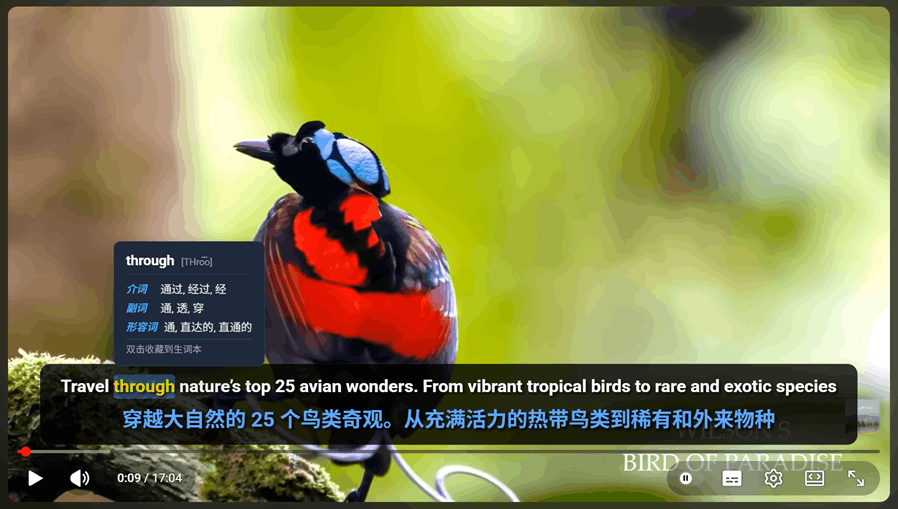
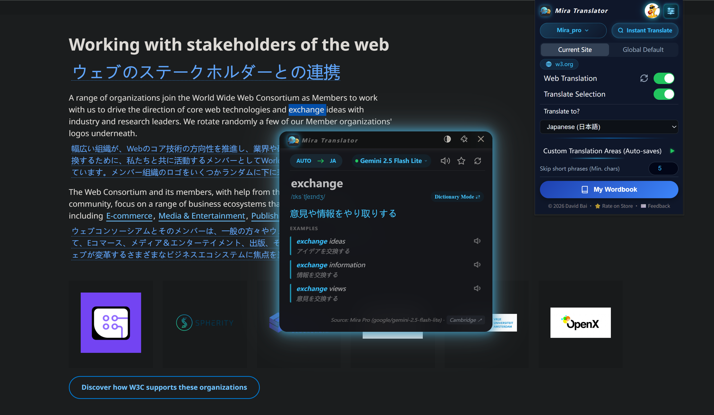
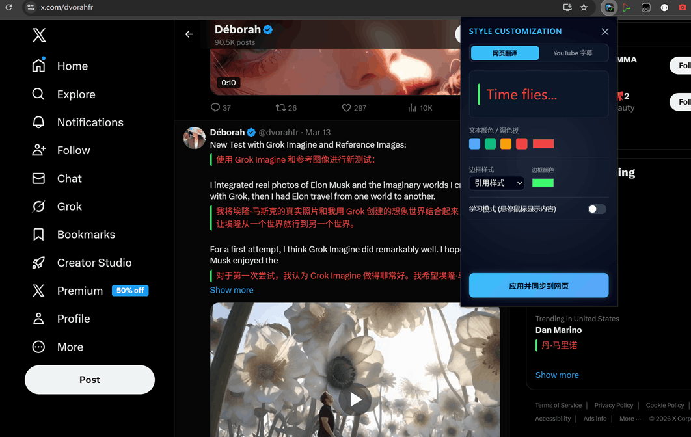
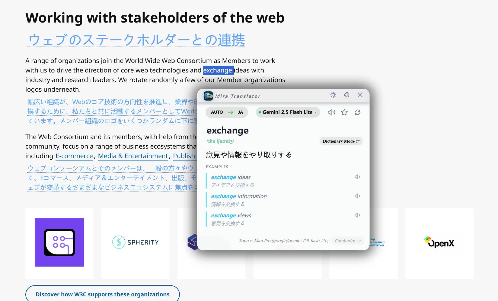

<p align="center">
  <a href="https://chromewebstore.google.com/detail/mira-translator/hmmllfdmkbmmfffjekhmmbhhfhhnocmn" target="_blank">
    
  </a>
</p>

<h1 align="center">Mira Translator</h1>

<p align="center">
  
  
  
  <a href="https://os9sur.github.io/mira-translator-home/">
    
  </a>
</p>

<p align="center">
  <b>Ultra-lightweight (~200KB) AI translation gateway. Simple setup, beautiful design, with real-time WYSIWYG visual feedback.</b>
</p>

<p align="center">
  <a href="https://www.youtube.com/watch?v=qUbX6mzlsag" target="_blank">
    
    <br>
    <b>Click to Watch Video Demo</b>
  </a>
</p>

<p align="center">
  
  
</p>
<p align="center">
  
  
</p>

---

## Technical Philosophy

**Mira Translate** is an immersive translation browser extension reimagined for performance and autonomy. Built with **pure native JavaScript**, it operates as a flexible **AI Translation Gateway**, allowing you to bypass "black-box" services and take full control of translation quality and cost using your own API keys.

Unlike bloated alternatives, Mira prioritizes a near-zero resource footprint and an intuitive **What You See Is What You Get (WYSIWYG)** user experience.

### Key Advantages

* **Performance //** Engineered with zero heavy frameworks. The entire core is approximately **200KB**, ensuring lightning-fast execution without slowing down your browser.
* **WYSIWYG Control //** True visual feedback. Adjust translation styles, colors, and layouts via the visual panel and see the effects on the webpage instantly.
* **Refined UI/UX //** A modern, aesthetic interface designed for clarity. Sophisticated power meets a minimalist, easy-to-configure design.
* **YouTube Toolkit //** Advanced dual-language rendering with integrated player styling and **one-click subtitle downloads**.
* **Zero-Trace Privacy //** Your API keys stay encrypted in your local browser. No intermediary servers, no data logging, no telemetry.

### Core Capabilities

* **Multi-Engine Support //** Native integration for OpenAI, Claude, Gemini, DeepL, and SiliconFlow. Supports fully customizable API endpoints.
* **Visual Element Selector //** Precision-targeted translation. Intuitively pick or exclude specific webpage elements using the visual selector tool.
* **Cloud Sync //** Seamlessly synchronize your vocabulary and configurations via Google Drive or WebDAV.

---

## Development & Build

### 1. Prerequisites
Ensure you have [Node.js](https://nodejs.org/) and [pnpm](https://pnpm.io/) installed.

### 2. Configuration
API keys are kept in a private file. Create your local config from the template:
```bash
cp private_config.example.js private_config.js
```

Edit `private_config.js` and fill in your `CLIENT_ID`, `MANIFEST_KEY`.

### 3. Build Commands

| Command | Target Browser |
| --- | --- |
| `pnpm dev` | **Chrome** |
| `pnpm dev:edge` | **Edge** |

---
© 2026 **David Bai**. Licensed under the [AGPL-3.0 License](LICENSE).
