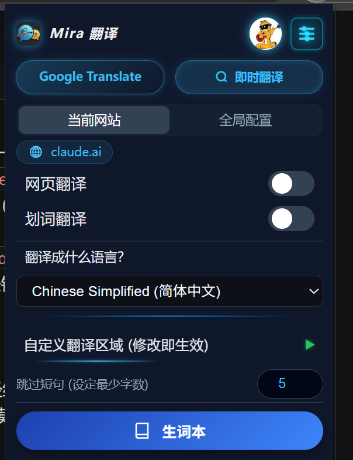
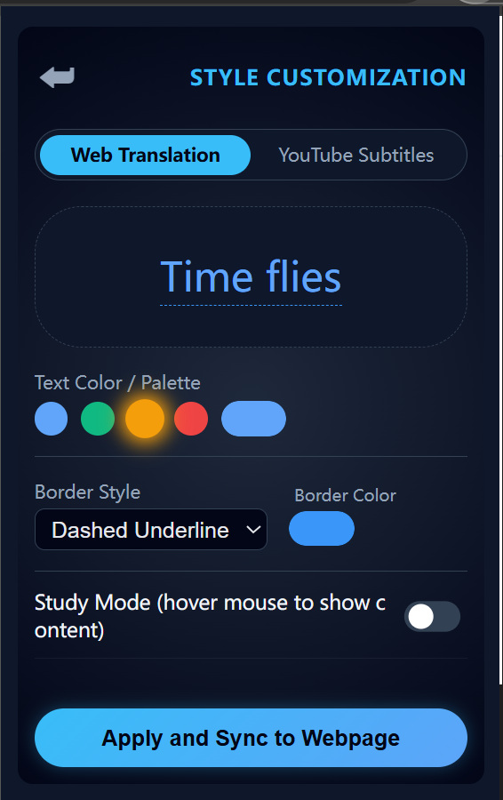
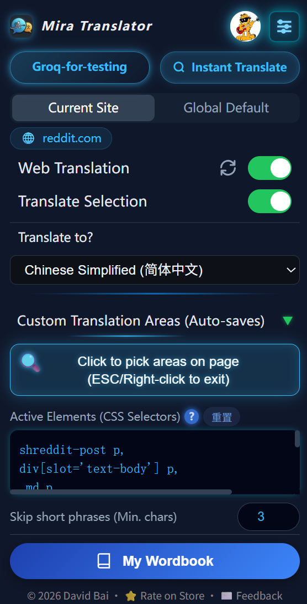

  <a href="README.md">English</a> · 简体中文 · <a href="README_ja.md">日本語</a>

  

<h1 align="center">Mira Translator</h1>

  <em>超轻量 (~300KB) AI 翻译网关 —— 基于原生 JS 构建，支持沉浸式阅读与 YouTube 双语字幕。零臃肿，隐私至上。</em>

  &nbsp;
  
  &nbsp;
  

  
  
  

 

  
  

  
  

  
  
  

---

## 💡 项目定位与免费替代方案

如果你只是需要一个完全免费、开箱即用的 AI 翻译工具，其实当前使用的浏览器本身就已经内置了相当优秀的方案：

- **Chrome 用户**：Gemini 侧边栏自带强大的网页阅读和内容分析功能。
- **Edge 用户**：内置的 Copilot 也能轻松搞定网页内容分析和视频字幕摘要。

**既然如此，为什么还要开发 Mira？**

市面上很难找到一款既好用、重视隐私，又不用担心浏览数据在后台被默默收集的开源翻译工具。因此，我利用业余时间自己写了一个。

Mira 完全是顺应我个人的需求和偏好打造的。它并非商业产品，我会按照自己的节奏进行维护。如果这个小工具恰好也契合你的需求，非常欢迎使用！不过由于精力有限，我无法保证它能完美兼容所有网站，也无法做到秒修 Bug，还请大家多多包涵。

---

## 技术概览

**Mira Translate** 是一款浏览器扩展，旨在通过用户自备的 API Key 提供翻译服务。它充当浏览器与各大翻译服务之间的轻量桥梁，方便用户无缝管理自己的 API 配置。

开发这个工具的初衷，是为了填补开源双语翻译工具在实用性上的空白，在保持极致简洁和高效的同时，砍掉了商业软件中那些冗余臃肿的功能。

### 功能特性

* **极致性能**：采用原生 JavaScript 编写，核心体积仅约 300KB，将浏览器资源占用降到最低。
* **可视化配置**：提供专门的面板，可自由调整注入网页的翻译样式、颜色和布局。
* **YouTube 深度集成**：支持双语字幕渲染、播放器功能调整以及字幕下载。
* **隐私至上**：API Key 仅本地存储在浏览器中，扩展绝不通过中转服务器处理翻译数据。
* **多模型支持**：兼容 ChatGPT / OpenAI（以及所有 OpenAI 兼容接口）、Claude、Gemini、DeepL、硅基流动（SiliconFlow）、本地大模型（如 Ollama）等，同时支持自定义 API 端点。
* **AI 上下文感知翻译**：告别生硬的词句直译，借助上下文语境提供更精准、更地道的翻译结果。
* **智能划区与元素选择**：默认专注于正文区域，自动跳过菜单和界面杂项，避免破坏网页排版和视觉杂乱；支持按需手动框选要翻译的区域或排除特定内容。
* **数据同步**：支持通过 Google Drive 或 WebDAV 同步配置及生词本。
* **生词本学习**：支持从译文中一键划词或短语加入本地生词本，方便后续复习、编辑及跨设备同步。
* **移动端支持**：兼容手机端浏览器（如 Android 上的 Microsoft Edge 和 Firefox），随时随地享受流畅翻译。

---

### **设计哲学**

Mira 专注于日常翻译的核心需求，尽可能减少繁琐的配置。绝大多数功能开箱即用，后台自动处理各项技术细节，为你带来极简纯粹的体验。

用户依然可以自定义那些真正重要的核心选项，例如：AI翻译口吻/角色、默认全局是否翻译、当前网站是否翻译、翻译区域、译文样式以及快捷键。

在进行 AI 翻译时，Mira 会尽可能将多段文本合并为单次请求，从而减少不必要的 API 调用，并大幅提升翻译效率。

## 开发与构建

### 1. 环境准备
请确保本地已安装 Node.js 和 pnpm。

### 2. 配置说明
API 密钥存放在私有配置文件中。请通过模板创建本地配置文件：
$ cp private_config.example.js private_config.js

编辑 private_config.js 文件，填入你的 CLIENT_ID 和 MANIFEST_KEY。

### 3. 构建与运行

| 命令 | 目标浏览器 |
| --- | --- |
| `pnpm dev` | **Chrome** |
| `pnpm dev:edge` | **Edge** |
| `pnpm dev:firefox` | **Firefox** |

---
© 2026 David Bai. Licensed under the AGPL-3.0 License.